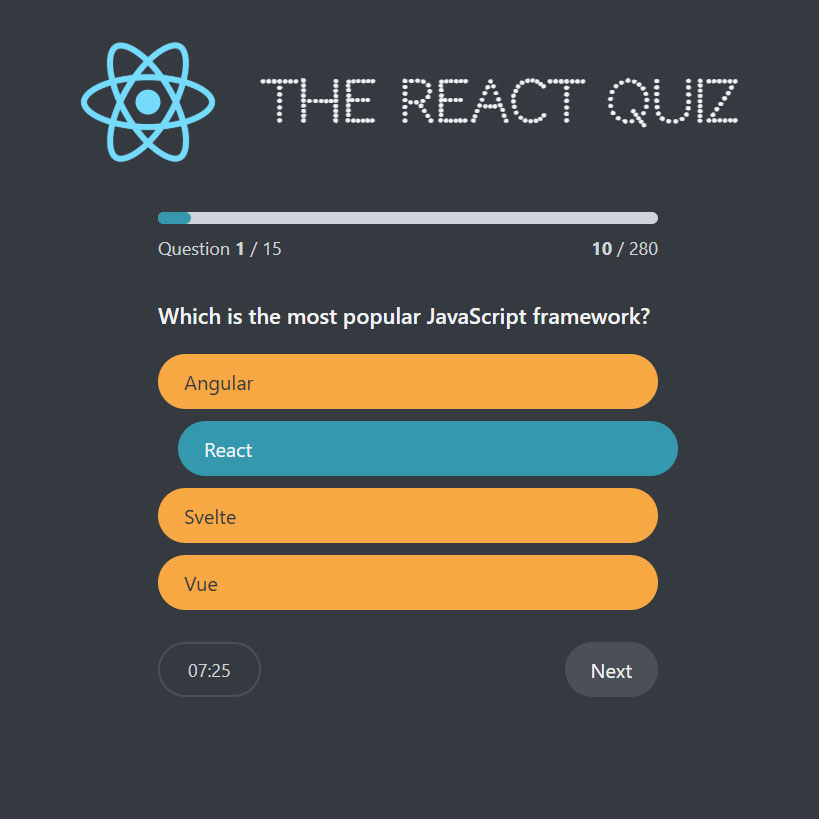

# React Quiz

React based mini-game, focused on using `useReducer` in practice.

## Available Scripts

In the project directory, you can run:

### `npm start`

Runs the app in the development mode.\
Open [http://localhost:3000](http://localhost:3000) to view it in your browser.

The page will reload when you make changes.\
You may also see any lint errors in the console.

### `npm run server`

Runs the JSON Server as a fake API endpoint provider on the PORT 8888 (or change it in `package.json`)

## Screenshots

